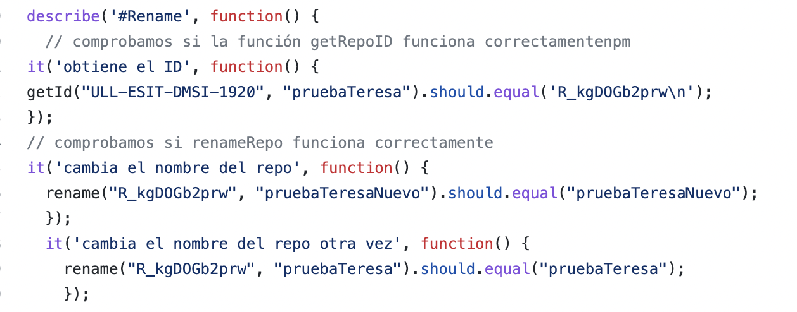
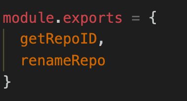
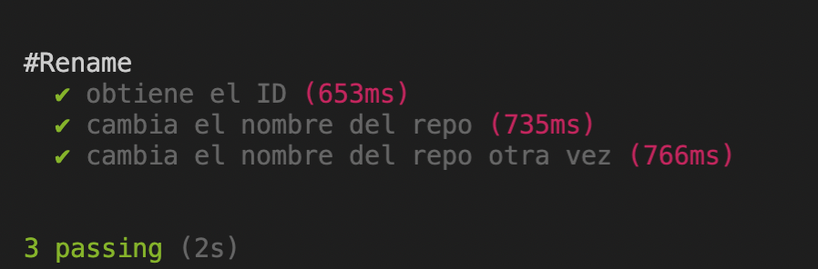

# Test de la extensión gh-repo-rename

## Mocha and Chai 
Empezamos describiendo las herramientas que vamos a utilizar para testear nuestro codigo. 

MOCHA: es un framework de pruebas para Node JS que puede ejecutarse desde la consola o desde un navegador. Permite realizar pruebas asíncronas de manera sencilla. Al ejecutar los test, permite la presentación de informes flexibles y precisos.

CHAI: es una librería de aserciones BDD/TDD para Node JS y navegador, que puede ser  emparejado con cualquier framework Javascript.

Para poder utilizar Mocha y Chai debemos instalarlas con el siguiente comando: 

```
npm install mocha --save-dev

npm install chai --save-dev

```
Ahora debemos crear un directorio test donde escribiremos nuestros test en un fichero .js. 
Aquí debemos escribir los tests que comprobarán si nuestro código funciona correctamente, con la sintaxis should.equal, lo que significa que le diremos lo que se debería esperar que aparezca como respuesta de la función y el test comprobará si es lo mismo, en cuyo caso pasará el test. Aquí vemos los tests escogidos: 



Debemos tener en cuenta que para que esto funcione es necesario exportar las funciones para que pueda comprobarse su correcto funcionamiento. Esto lo hacemos de la siguiente manera en el fichero repo-rename.js.



Una vez desarrollados los tests, podemos ejecutar npm test, ya que lo hemos declarado en el script en el package.json. El resultado es el siguiente:  



Como podemos observar, nos indica claramente con la breve discripción que habíamos indicado que tests han pasado y cuales no.

## Documentación

Para añadir la documentación de forma automática podemos utilizar JSDoc. JSDoc es una sintaxis para agregar documentación de la API al código fuente de JavaScript. 
Ejecutaremos el siguiente comando para instalar y generar el documento html con la documentación del código del fichero escogido, en este caso repo-rename.js: 
```
npm install -g jsdoc
jsdoc repo-rename.js

```

# Actions

Las acciones de Github permiten crear flujos de trabajo personalizados que se dividen en subtareas denominadas acciones. Estas acciones pueden ser desencadenadas por determinados eventos. 

Las acciones son el bloque de costrucción más pequeño en el desarrollo del workflow, se combinan para acabar creando un job. 

Hay numerosas acciones creadas por la comunidad de GitHub que son públicas y cualquiera puede utilizar, esto es muy útil porque es tan sencillo como reutilizar esas acciones y no tenemos ni que implementarlas.

En nuestro caso, crearemos un action que nos permitirá en cada push y pull comprobar los tests que hemos desarrollado con Mocha y Chai.
Podemos encontrar el código en la carpeta .gothub/workflows, aquí es donde se encuentran las actions de cualquier repositorio.

### Job
Un job está compuesto por diferentes steps, se puede organizar para que se produzcan de forma independiente o secuencialmente.
 
### Step
Es una tarea individual que pueden ser comandos o acciones en un job. 

### Event
Un evento es una actividad que lanza el workflow. 


